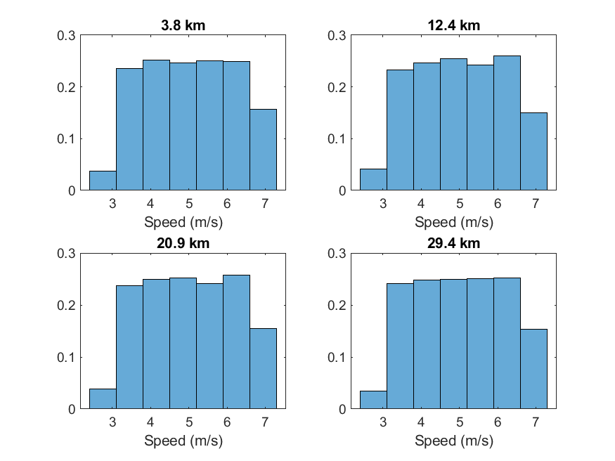
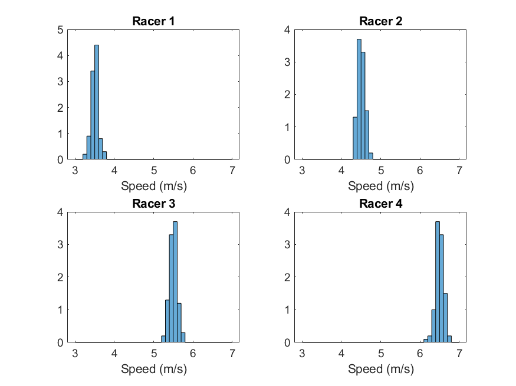

# London Marathon
A quick demo of a stationary non-ergodic random process in MATLAB.

In this simulation, 5000 well-paced runners race along a flat, windy course in London. Each runner has a different average speed, and are affected by a random headwind. Observe the runner's speeds across the duration of the marathon. The runner's speeds make up a _random process_, and an individual runner's speed is a _sample function_. Below are four sample functions plotted on top of one another.

If the race committe set up radar guns at different locations along the race course and made a histogram of the runners' speeds as they passed the radar gun, we would see the following distributions. The speed of the runners at a specific location on the course is a _random variable_ and has a distribution. Notice that the distributions are roughly the same regardless of where the radar gun was positioned. Thus, the random process is _stationarity_.

If we were to make a histogram of a particular runner's speed throughout the entire marathon, it would be different than another runner's histogram because different runners have different average speeds, as shown below. Since the histograms below do not match up with the histograms above, the random process is non-ergodic.

